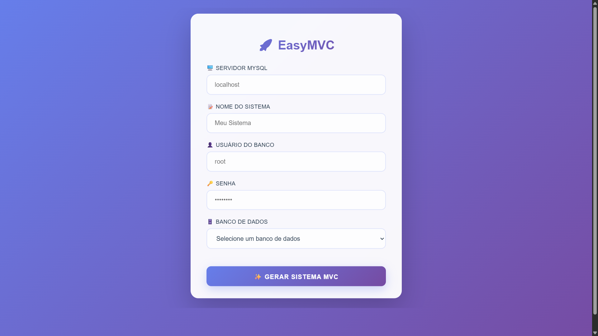
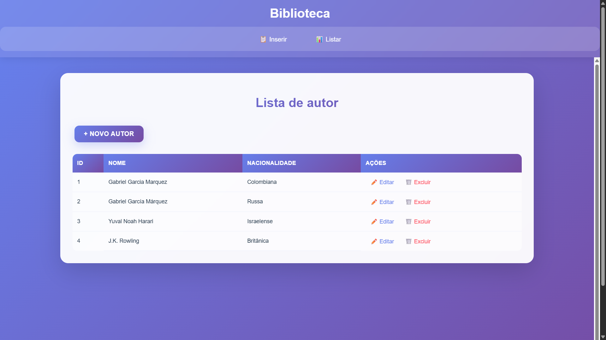

# EasyMVC

EasyMVC é um gerador automático de sistemas web completos em PHP, desenvolvido em sala de aula para facilitar a criação rápida de aplicações CRUD com arquitetura MVC.

---

## 🚀 Funcionalidades

- **Geração automática completa** de sistemas MVC a partir do banco MySQL
- **CRUD completo** para todas as tabelas do banco automaticamente

---

## 🛠️ Tecnologias Utilizadas

- **Backend:** PHP 8+, PDO, padrão MVC + DAO
- **Banco de Dados:** MySQL
- **Frontend:** CSS3 (Glass Morphism), HTML5 responsivo
- **Arquitetura:** Model-View-Controller com Data Access Object
---

## 📸 Telas da Aplicação

### Tela de Configuração Inicial


### Sistema Gerado - Menu Principal
 

### Inserção
 

### Listagens 
 


---

## ⚙️ Como Executar

1. Clone o repositório:
   ```bash
   git clone https://github.com/GiKassime/easyMVC.git
   ```
2. Acesse a pasta do projeto:
   ```bash
   cd easyMV
   ```
3. Configure seu servidor web (Apache/Nginx) para apontar para a pasta do projeto.
4. Certifique-se de ter MySQL rodando e um banco de dados criado.
5. Acesse o sistema pelo navegador: [http://localhost/easyMV](http://localhost/easyMV)
6. Preencha os dados de conexão MySQL e selecione o banco de dados.
7. Clique em "Gerar Sistema MVC" e aguarde a criação automática.
8. Baixe o arquivo `sistema.zip` gerado ou acesse a pasta `sistema/` criada.

---

## 🏗️ Estrutura do Sistema Gerado

```
sistema/
├── index.php          # Página principal com menu
├── inicio.html         # Página de boas-vindas
├── css/
│   └── estilos.css     # Estilos 
├── model/
│   ├── conexao.php     # Classe de conexão
│   └── [tabela].php    # Models para cada tabela
├── view/
│   ├── [tabela].php    # Formulários CRUD
│   └── lista[Tabela].php # Listagens
├── control/
│   └── [tabela]Control.php # Controllers
└── dao/
    └── [tabela]Dao.php # Data Access Objects
```

---


## 📞 Contato

- **EMAIL** - [giovana.kassime.tds2023@gmail.com](mailto:giovana.kassime.tds2023@gmail.com)
- **GitHub:** [GiKassime](https://github.com/GiKassime)
- **LinkedIn:** [Giovana Kassime](https://www.linkedin.com/in/giovana-kassime-9849141a1/)

---

